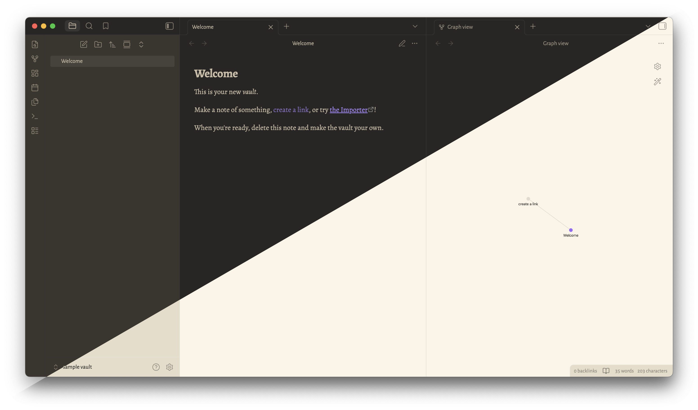

# Obsidian Tea and Coffee

Tea and Coffee is an [Obsidian](https://www.obsidian.md) theme forked from [Typewriter](https://github.com/crashmoney/obsidian-typewriter) by [crashmoney](https://github.com/crashmoney).

This theme is modified from the original Typewriter theme to suit my personal tastes and as the theme to [my personal website](https://www.richardqnguyen.com). Mainly, colors were converted to [OKLCH](https://oklch.com), typefaces were changed, and flourishes were added here and there.

## Development

This theme is currently under development. [Issues](https://github.com/richardqnguyen/obsidian-tea-and-coffee/issues) and [pull requests](https://github.com/richardqnguyen/obsidian-tea-and-coffee/pulls) are welcome.

Please see [Releases](https://github.com/richardqnguyen/obsidian-tea-and-coffee/releases) for changes between updates.

## Installation

### Recommended (Obsidian Theme Manager)

1. Open Settings
2. Navigate to Appearance
3. Press the "Manage" button
4. Search for Tea and Coffee and press "Install"

### Manual

You can also manually install this theme.

For Obsidian version 0.16.0/1.0.0 and above:

1. Download `theme.css` and `manifest.json`
2. In your vault's hidden theme directory (`.obsidian/themes/`), create a `Tea and Coffee/` directory
3. Move `theme.css` and `manifest.json` into the `.obsidian/themes/Tea and Coffee` folder

## Credits

Inspiration and/or some code were taken from the following:

- [Typewriter](https://github.com/crashmoney/obsidian-typewriter)
- [Minimal by @kepano](https://github.com/kepano/obsidian-minimal)
- [Yin and Yang by @chetachiezikeuzor](https://github.com/chetachiezikeuzor/Yin-and-Yang-Theme)
- [Deep Work by @nikbrunner](https://github.com/nikbrunner/obsidian-deep-work-theme)
- the Scrivener theme A Midsummer Night for the colors behind Typewriter's dark mode
- Solarized Light for the colors behind Typewriter's light mode

### Fonts

Default fonts used have been base64 encoded using <https://transfonter.org> for Extended Latin only. They were chosen specifically to support IPA and Vietnamese. They don't have to be installed and are available on mobile unless other language support is needed. Complete encodings are listed in [fonts.css](fonts.css).

- Interface
  - [Alegreya Sans (Google Fonts)](https://fonts.google.com/specimen/Alegreya+Sans)
- Text
  - [Alegreya (Google Fonts)](https://fonts.google.com/specimen/Alegreya)
  - Times New Roman
- Monospace
  - [Monaspace Xenon (GitHub)](https://github.com/githubnext/monaspace)
- Emoji
  - [DoCoMo Emoji (Monica Dinculescu)](https://meowni.ca/posts/og-emoji-font/)
  - [Noto Emoji (Google Fonts)](https://fonts.google.com/noto/specimen/Noto+Emoji)
